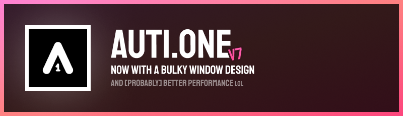
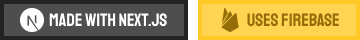

This is a new version of my [website](https://auti.one), which is up to be somewhat simpler and better informative, while keeping nice features and easter eggs.

I just decided to make v7 open-source, because yeah. The site uses Next.js, including on part of the back-end, which uses Firebase for storage and authentication.

If you find out any wonky stuff while checking in the code, you can get in touch with me! Contact info is included in the site, and on [my profile](https://github.com/autione) as well.
